# Puzzle Fun

## Introduction
Puzzle Fun is a web based online game built in with HTML, CSS and JavaScript. It is based on simple classic sliding square puzzle game. Users would receive cognitive benefits while having fun. Puzzle Fun is designed to target those who would like a short fun game to play regularly to improve their memory, problem solving skills and reduce their stress level.  
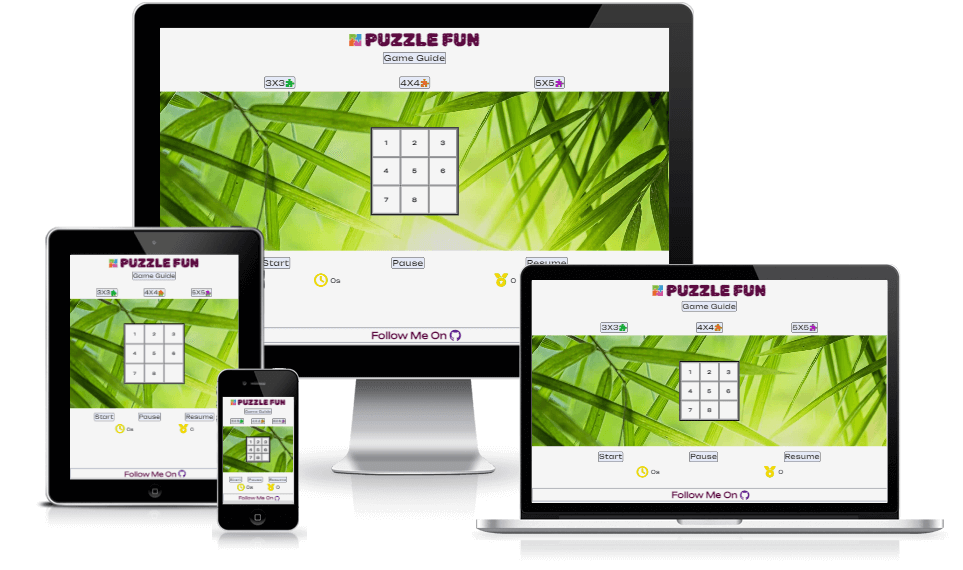  

| Site Goals| User Benefits | 
|:------------- | :------------ | 
|Short game with simple instruction | Simple and short Brain exercises | 
|Easy and intuitive navigation| Easy to start, exit and re-enter the game|
|Responsive design | Able to play on any device (keyboard or touch screen)|  
|Selection of Defficulty levels|A choice of easy or challenge game|
|Relax game environment |Comfortable to play|
|interactive to the player|Have a control in running the game|
|Score tracking and timing|Able to see their performance|

Press CTRL+ Click [here](https://yuyizhong.github.io/puzzelfun/) to visit the live website.

## Features
This site was built based on the simple and intuitive principle. It only contains one page with the puzzle game created and inserted each time by JavaScript according to users' instruction. The whole layout is simple and easy to navigate, and the purpose of the site is straight-forward. Icons and aria-labels are used throughout the web page to enhance users' comprehension.  

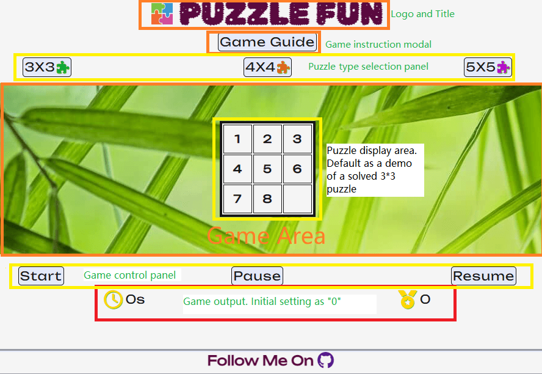 

### Existing Features

- **Favicon**
   - A favicon is implemented with a colorful four-piece puzzle.
   - This puzzle logo appears in the tab header to allow the user to easily identify the website while multiple tabs opening.
     

- **Logo and Title**
   - The colorful puzzle logo and the gemstone-sparkled title bring the website alive.   
   - It carries out the simple style and declares the purpose of the website: puzzle games and fun!  
   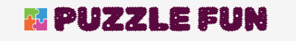  

- **Game Guide Modal**
   - A modal button created underneath the page title is named "Game Guide". It contains the game information, rule and level difference for users' reference.   
   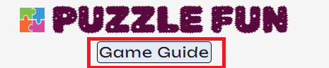  
   - By clicking on it, a detailed game guide block drops out. When reading it on mobile, a scroll bar appears to scroll through the guide. When screen size is big enough, the scroll bar becomes hidden.  
   - The benefit of having the game guide as a modal makes the website clean and neat.   
   - A zoom animation used when the guide block opens.    
   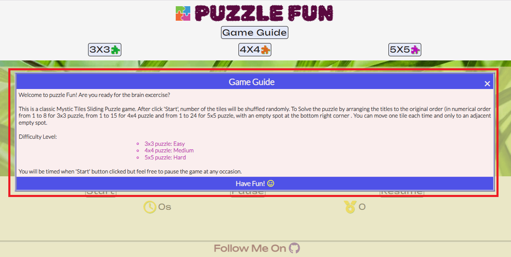  

- **Puzzle type buttons**
   - Puzzles are divided into 3 types according to the difficulty level.   
   - They are listed at the selection panel for the user to choose. Users can either have a easy go by starting a 3x3 puzzle, or take a challenge for a more omplicated          level.     
   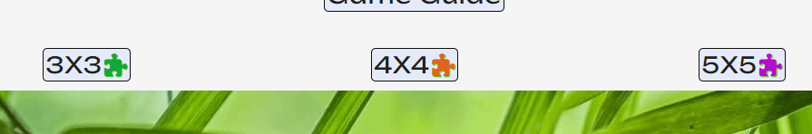  

- **Game area and default game**
   - A beautiful picture of bamboo leaves is set as the background image for game area.  The eye friendly green color would hopefully reduce the user's eye strain. This photo image is supposed to immediately create a peaceful and leisurely feeling.   
   - As the page loaded, a default 3x3 demo puzzle is appeared at the center of the game area. The user can either click on "Start" to play a 3x3 puzzle or click on one of      the game type buttons to play a more challenging puzzle.      
     

- **Demo puzzle**
   - Demo puzzle appears after the game type is selected. It demonstrates what a solved puzzle in this particular puzzle type would look alike.   
   - Its tiles are not movable and tiles color is all in white. Therefore users won't mistake it as the game itself.  
   **4x4 Demo Puzzle**     
   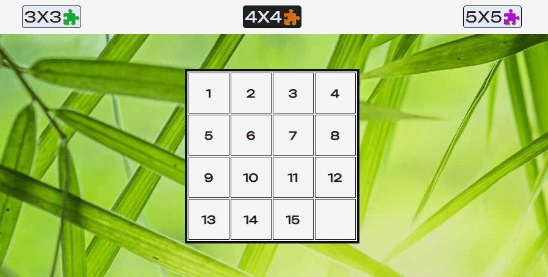    
    **5x5 Demo Puzzle**  
   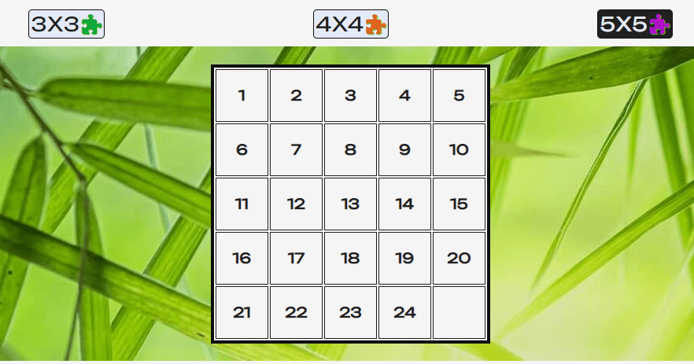  
   - When Demo puzzle displays in the game area, the control panel and user performance trackers remain as default setting.  
   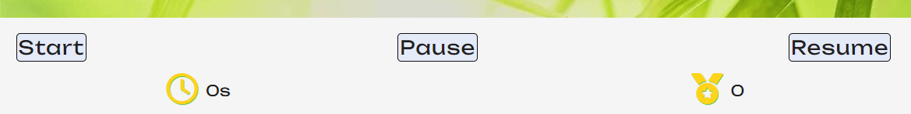  

- **Control Panel**
   - Control buttons listed underneath the game area give flexibility to users to run the game.   
   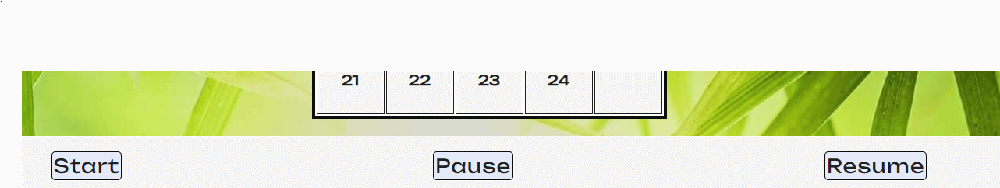   

   - **Start** Button:  
      - **"Start"** button allows the tiles in the demo puzzle to shuffle and a new game with a **BLACK** empty tile will be ready to play.  
      - After clicking on the "Start" button, it changes to **"Restart"**. Users can click on **Restart** button any time to reshuffle a new puzzle within the same game type.  
      - By clicking on both **Start** and **Restart** button, the clock value will reset to 0 and start a new timer.  
      - Which means users have the freedom to exit the current puzzle game before finishing it and start a new game.  
      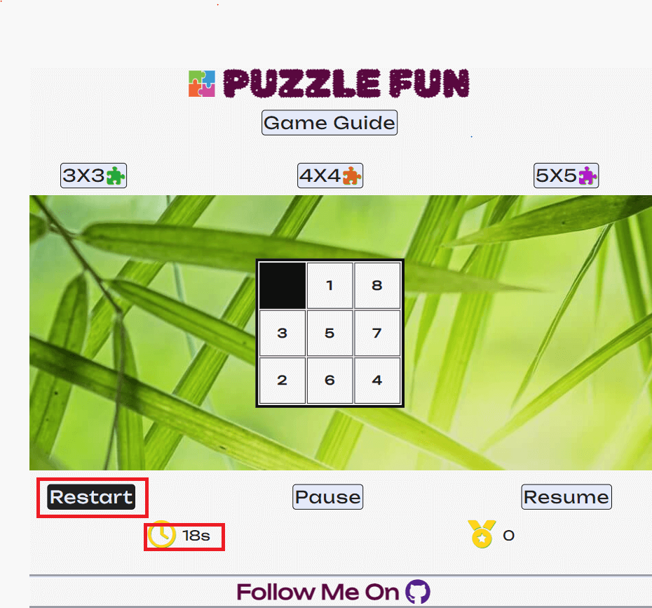    
   - **Pause** Button  
      - **Pause** Button allows the user to pause the timer anytime they needed.  
      - Their performance tracker wont be affected by interruptions.    
      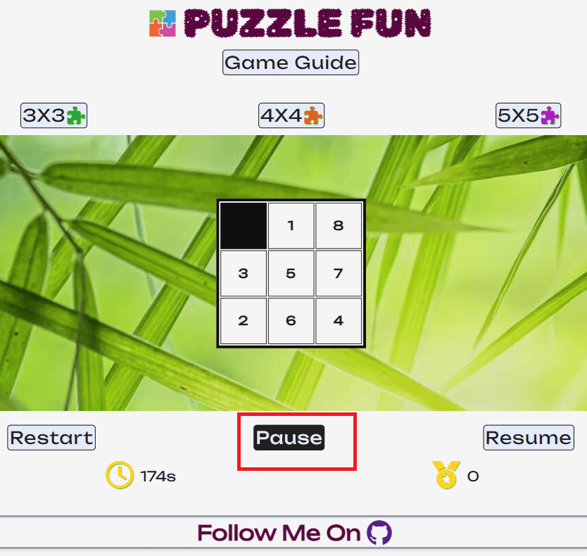      
   - **Resume** Button  
      - It continues the timer from where it stopped.   
      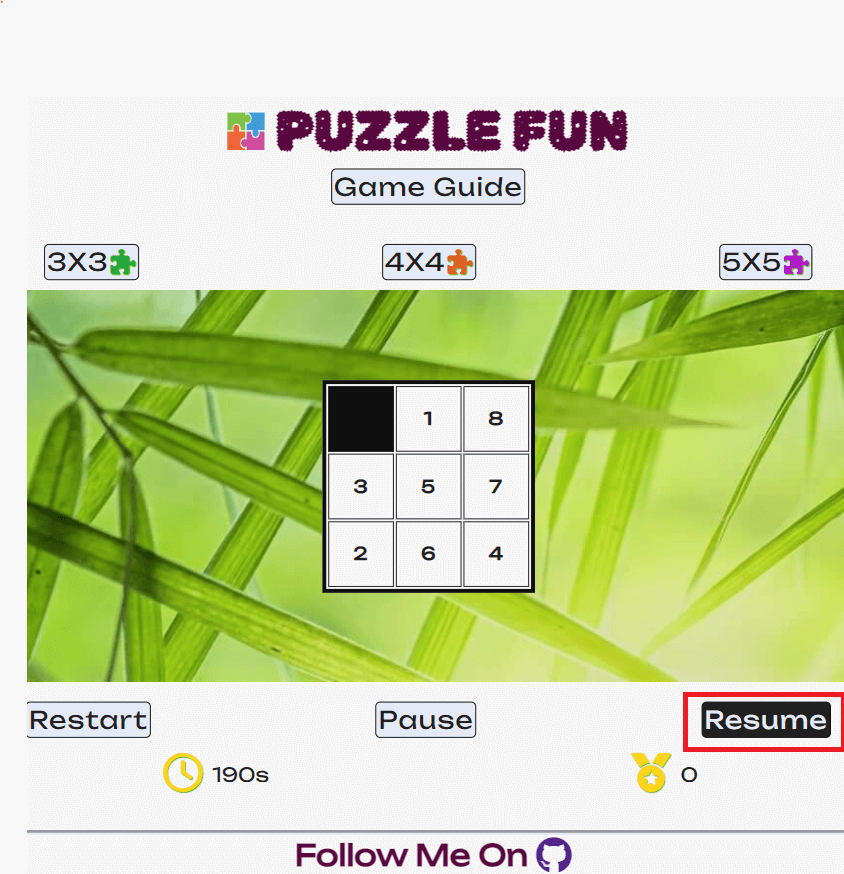      

- **Game Time and Score trackers**  
   - The intuitive clock and medal icons represent the timer and score.    
   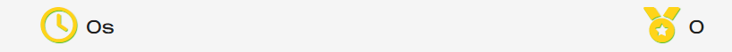
   
   - Timer tracks the total seconds which users spend in each single game. It resets to zero everytime a new game is displayed regardless puzzle type.   
   - Score increments within one level (either 3x3,4x4 or 5x5 puzzles). It resets to zero when user hits one of the puzzle type button.  
   - With the time and score tracking system, users are able to see their performance. It makes the game more engaging.  
   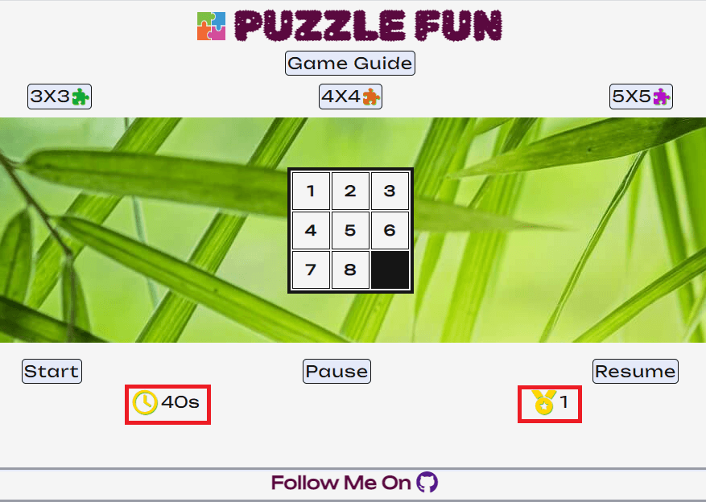    
   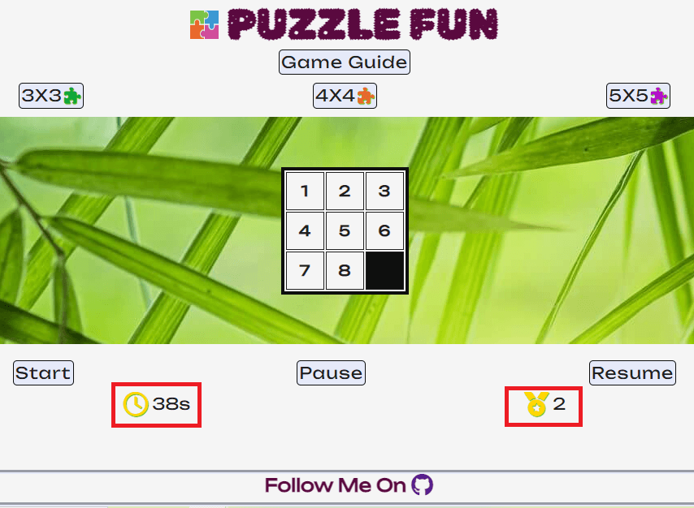    

- **Footer**
   - A footer is sticked to the bottom of the viewport when the screen is big enough. 
   - It contains site owner's GITHUB link which will open in a new tab to allow easy navigation for users.   
   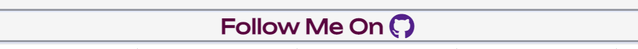   

- **Winning message**
   - Wining message appears when the user solves the puzzle.  
   - It alerts a congratulation message including the time spent for solving this puzzle.   
   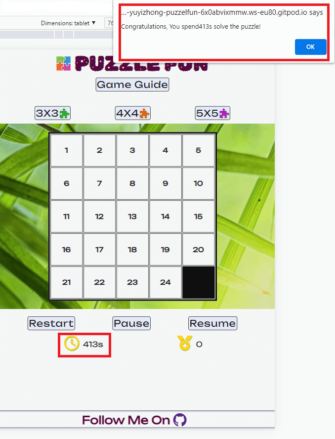   

- **404 Error Page**
   - A 404 Error page with Puzzle Fun site header and footer to indicate the user the resource they were trying to reach not found on the server.
   - The home page link is provided to bring the user back to the main page.
   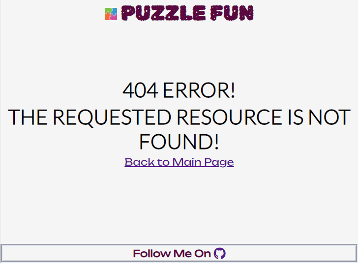   

## Features left to implement

- Games can be extended from number puzzles to Jigsaws. In order to have a background picture for each tile and move together with the tiles to form a whole picture, canvas JS would be ideal in this case.  
- A user account can be created for each player and all the time and score records in the past could be stored there. In order to do that, it requires a server to store all the data and I should be able to do it when python is involved.  

## Technologies  

- *HTML*
   - The structure of the Website was developed using HTML as the main language.
- *CSS*
   - The Website was styled and laid out using CSS in an external file.
- *JavaScript*  
   - The puzzles are created through JavaScript and inserted into HTML. 
   - All the interactions between users and computer are all realised through JavaScript functions and event listeners. 
- *GitPod*
   - This developer platform with VSCode editor can remotely work through web browser.
- *GitHub*
   - Source code is hosted on GitHub and deployed using Git Pages.
- *Git*
   - Used to commit and push code during the development of the Website
- *Font Awesome*
   - Icons obtained from https://fontawesome.com/ were used through out of the website.
- *Tinyjpg*
   - All the images used at the website and README were reduced size at https://tinyjpg.com/ 
- *Favicon.io*
   - Favicon files were created at https://favicon.io/favicon-converter/
- *Am I Responsive*
   - Screen shots of the various device breakpoints for the website were produced at https://ui.dev/amiresponsive/

## Testing

### Testing during development
Continuous testing was carried out throughout of the site development. The whole project was broken into small sections and steps. Each part was checked and amended to the right standard before moving to the next one. 

*Steps to test:*

- Each small section of HTML and CSS development was instantly viewed through a live server window. It would be checked and adjusted (if necessary) before commitment.   
- Before start coding JavaScrip, how to make the game working logically was well thought out and designed. Ideas then turned into function names and their contents were added one by one at later stage.
- To avoid increasing difficulty of debugging, one function was coded for achieving only one thing. Also this function would be tested constantly after each correction. 
- The *developer tool* was used to indicate where the errors were. 
- In the case of no errors were returned but function not working, `console.log` was used to test each line of the code to find where the possible errors located. 
- Until one function is working, then move to next one. And same procedures would be carried out.
- When individual functions are working well by itself, but issues appeared when running together. Then the relevent functions would be reviewed logically and adjusted accordingly.

*Result*:

- Interesting issues encountered:
   - **Issue No. 1**  
   - There were 2 functions called in sequent to move tile and then check if it wins. If the user wins, the `checkWin()` will alert a winning message. At the test, the winning message appears right after the user clicking on the tile but before it moves to the right spot. It happened as the `checkWin() ` was processed faster than `MoveTile()`. 
   - The solution was to use `setTimeout()` method to execute `checkWin()` half of a second later than `MoveTile()`. 

   - **Issue No.2**  
      - The "Restart” button is designed for users to reshuffle the puzzle anytime during the game if they don't want to continue working on the current one for any reason. Everytime after reshuffle, a new game appears and the timer will reset and start a new one (by processing `clearTimeout(timer)` and then `setTimeout(timing, 1000)`). 
      - By testing it, I fund if the user keeps clicking on "Restart" at a fast speed, it will mess up the timer. Timer wont reset to 0, and it would run faster and faster than it supposed to be. Until the user stop clicking, then the timer will slowly go back to normal speed.
      - First, I tried to change `setTimeout()` method to `setInterval()` method, but the issue remains.
      - After a research, I realised that JavaScript timer would have this type of issue as it using a single threaded language. When clicking is too fast, computer wont have enough time to complete one request before receiving another one. And it tried to execute all the orders at same time.
      - As to make a smarter timer is not possible in JavaScript, my solution was to limit the clicking behaviour. To do that, I disable the "Restart” button for 2 seconds after each click.
- After finishing building, the website and game looks and works as planned.  
 
### Responsiveness

This site was tested to ensure responsiveness on screen sizes from 320px and upwards on Chrome, Edge and Firefox.

*Steps to test:*

- Open browser and paste https://yuyizhong.github.io/puzzelfun/ to address bar to navigate.
- Right click on the webpage and then inspect to open the developer tools
- Set to responsive and decrease width to 320px and the zoom to 50%
- Click and drag the responsive window to maximum width

*Result*:

- Website is responsive on all screen sizes from mobile, tablet, laptop and desktop. No images are pixelated or stretched. No text were overflowed or cut off. No contents were out of their box or get overlapped.
- It functions well by using both keyboard and touch screen devices.

### Wave Web Accessibility

[WAVE Web Accessibility Evaluation Tools](https://wave.webaim.org/) was used throughout development and for final testing of the deployed website to check for any aid accessibility testing. 

*Result*
- 0 Errors and 0 Contrast errors.
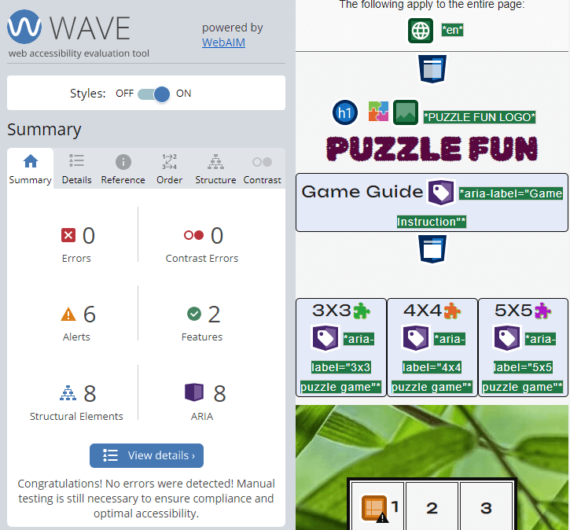   

### Lighthouse Testing
- Test on desktop

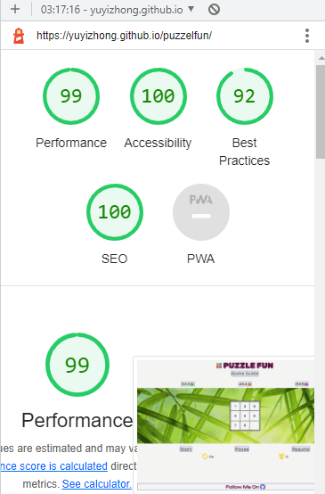   

- Test on mobile

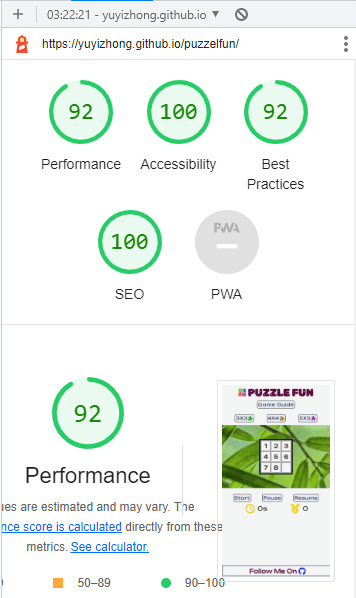   

### Functional Testing

 *Game Guide Modal*

- Testing was performed on the Game Guide button in heading underneath the page tile to ensure the game instruction works as planned.  

  *Steps to test Guide Modal*

     - Navigate to Puzzle Fun and click the button shows "Game Guide".  

  *Result:*

     - A block of game instruction pops out at the right position. 
     - The instruction page contains header, footer and the main body. Nothing is missing or hidden.
     - Scroll bar appears on the side of the main body when visiting the site through a mobile device and it works well.
     - Scroll bar disappears when the screen space is big to show all the instruction contents. 
     - Also it can be closed by clicking on "x" and the instruction block becomes hidden again.
     - It was as expected.  

 *Game Type Buttons*

- The 3 buttons under the Game guide represent 3 types of puzzle game. Tests were carried out to check if they bring the users the right puzzle type with control buttons, time and score trackers always showing default setting whenever the user clicking on them.

  *Steps to test Game Type 3x3 puzzle*

     - Click the button shows "3x3" after window loaded. 
     - Click on this button during a game (after "Start" got clicked).
     - Click on this button after a game got paused.  
     - Click on this button after a game resumed.  
     - Click on this button when any of the game type button was currently selected.  

  *Result:*

     - A 3 rows and 3 columns puzzle appeared at the center of the game area.  
     - The tiles are all in white and unmovable.
     - Numbers are sorted in ascending numerical order with the last tile not having any number.  
     - Game control buttons are "Start", "Pause" and "Resume".  
     - Timer and Score remain as default setting shows "0".  
     - It was as expected.  

  *Steps to test Game Type 4x4 puzzle*

     - Click the button shows "4x4" after window loaded. 
     - Click on this button during a game (after "Start" got clicked).
     - Click on this button after a game got paused.  
     - Click on this button after a game resumed.  
     - Click on this button when any of the game type button was selected.  

  *Result:*

     - A 4 rows and 4 columns puzzle appeared at the center of the game area.  
     - The tiles are all in white and unmovable.
     - Numbers are sorted in ascending numerical order with the last tile not having any number.  
     - Game control buttons are "Start", "Pause" and "Resume".  
     - Timer and Score remain as default setting shows "0".  
     - It was as expected.  

  *Steps to test Game Type 5x5 puzzle*  

     - Click the button shows "5x5" after window loaded. 
     - Click on this button during a game (after "Start" got clicked).
     - Click on this button after a game got paused.  
     - Click on this button after a game resumed.  
     - Click on this button when any of the game type button was selected.  

  *Result:*

     - A 5 rows and 5 columns puzzle appeared at the center of the game area.  
     - The tiles are all in white and unmovable.
     - Numbers are sorted in ascending numerical order with the last tile not having any number.  
     - Game control buttons are "Start", "Pause" and "Resume".  
     - Timer and Score remain as default setting shows "0".  
     - It was as expected.  

 *Check and Move tiles*

- Game rule is to move one of the tiles adjacent to the empty tile and sort the numbers to the right order. The test is to find out if only the tiles adjacent to the empty tiles can be moved and the others are not. 

  *Steps to test Check and Move tiles*

     - Navigate to Puzzle Fun default page.  
     - Step 1. Click on "Start" button.  
     - Step 2. When a game starts, randomly click on any of the tiles.  
     - Step 3. Click on "Restart" button, after a new puzzle loaded, click on any of the tiles.  
     - Click on the 3x3 type button and repeat steps 1 to 3.  
     - Click on the 4x4 type button and repeat steps 1 to 3.  
     - Click on the 5x5 type button and repeat steps 1 to 3.  

  *Result:*

     - Only the tiles adjacent to the black empty tile can be moved by clicking and they will swap their position with the black tile.  
     - The tiles not adjacent to the black tile remain unmoved when clicking on them.
     - It was as expected.  
   
 *CheckWin*

- Test was carried out to see if a winning message pop out when the user solve the puzzle.   

  *Steps to test CheckWin*

     - Navigate to Puzzle Fun default page.  
     - Step 1. Click on "Start" button.  
     - Step 2. When a game starts, click on the tile you want to move until the puzzle is solved.  
     - Step 3. Click on "Restart" button, after a new puzzle loaded, do Step 2.  
     - Click on the 3x3 type button and repeat steps 1 to 3.  
     - Click on the 4x4 type button and repeat steps 1 to 3.  
     - Click on the 5x5 type button and repeat steps 1 to 3.  

  *Result:*

     - A congratulation message box popped out and the timer was stopped.  
     - After click on "ok" at the message box, message disappeared. Timer remained at the time when it was stopped and score was added one more than before.
     - It was as expected.  

 *Start Button*

- Test is to check if the game would actually start after clicking on "Start" button.

  *Steps to test Start button*

     - Navigate to Puzzle Fun default page.  
     - Step 1. Click on "Start" button.  
     - Click on the 3x3 type button and conduct steps 1.  
     - Click on the 4x4 type button and conduct steps 1.  
     - Click on the 5x5 type button and conduct steps 1.  

  *Result:*

     - Demo puzzle is replaced with a puzzle game having numbers in random order and a black empty tile.  
     - "Start" button text changes to "Restart".
     - Timer starts to time from 0.
     - It was as expected.  
     
 *Restart Button*

- Test if restart button reshuffle the puzzle, reset the timer and current score value remains unchanged. 

  *Steps to test Restart button*

     - Navigate to Puzzle Fun default page.  
     - Step 1. Click on "Start" button and then click on "Restart" when text changed.  
     - Click on the 3x3 type button and conduct step 1.  
     - Click on the 4x4 type button and conduct step 1.  
     - Click on the 5x5 type button and conduct step 1.  

  *Result:*

     - The numbers of the puzzle shuffled every time the restart button pressed.  
     - The timer reset to zero and start a new timing.  
     - Score remains as unchanged.  
     - It was as expected.  

 *Pause Button*

- Test is to check if Pause button stops the timer.  . 

  *Steps to test Pause button*

     - Navigate to Puzzle Fun default page.  
     - Step 1. Click on "Start" button.  
     - Step 2. After the timer starts, click on the pause button at any point.        
     - Step 3. Click on "Restart" button, conduct step 2.  
     - Click on the 3x3 type button and repeat steps 1 to 3.  
     - Click on the 4x4 type button and repeat steps 1 to 3.  
     - Click on the 5x5 type button and repeat steps 1 to 3.  

  *Result:*

     - Timer paused instantly.  
     - Nothing else is changed.
     - It was as expected.  

 *Resume Button*

- Test if Resume button continues the timer after stopped by pause. 

  *Steps to test Resume button*

     - Navigate to Puzzle Fun default page.  
     - Step 1. Click on "Start" button.  
     - Step 2. After a game starts, click on the pause button and press the resume button at any point.  
     - Step 3. Click on "Restart" button, conduct step 2.  
     - Click on the 3x3 type button and repeat steps 1 to 3.  
     - Click on the 4x4 type button and repeat steps 1 to 3.  
     - Click on the 5x5 type button and repeat steps 1 to 3.  

  *Result:*

     - Continued timer from where it was stopped.  
     - Nothing else is affected.
     - It was as expected.
     
 *Timer*

- Test if Timer immediately starts when game is loaded and restarts from zero whenever a new game is started. Also if it responses to pause and resume correctly at any circumstances. 

  *Steps to test Timer*

     -Timer was also tested when testing Start, Restart, Pause and Resume functions.     

  *Result:*
  
     - It was as expected.  

 *Score*

- Test when user continues playing the puzzles within the same type if score increments when user solve each puzzle. Test would also check if it resets to zero after the puzzle type button is clicked.

  *Steps to test Score*

     - Repeat all the steps at checkWin test.
     - In order to see if it increments when playing the same type puzzles, after the winning messsage is closed, click on restart and play another one until winning again.    

  *Result:*

     - After winning message is closed, the score increments.
     - If the user leaves the current puzzle type mode and click on the other game type, score rest to zero.
     - It was as expected. 

*Shuffle*

- Test if puzzles get shuffled after "Start" and "Restart" Buttons clicked. 

  *Steps to test Shuffle*

     -Shuffle function was also tested when testing Start and Restart functions.     

  *Result:*
  
     - It performed as expected. 

 *Github Link* 
- Click on the Github icon at the center of the footer. The specified Github page opens at a new tab.  

### Validator Testing ###

  *HTML Testing* was performed to Puzzle Fun through the [official W3C validator](https://validator.w3.org/). 
  No Error was fund.

  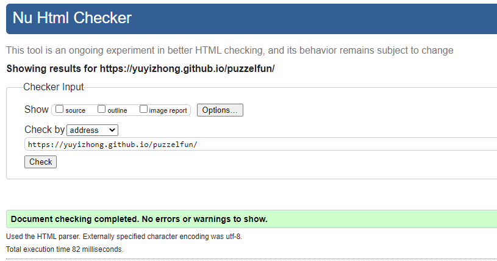   

 
  *CSS Testing* was performed to Puzzle Fun through the [official (jigsaw) validator](https://jigsaw.w3.org/css-validator/). 
  No Error was fund.

  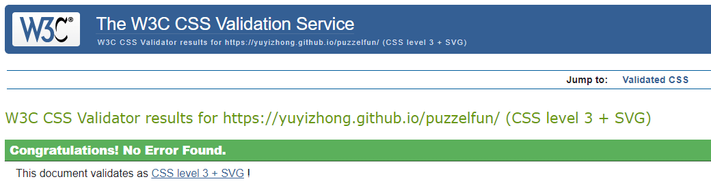   

  *JavaScript Testing* was performed to Puzzle Fun through the [Static JavaScript analysis tool](https://jshint.com/). 
  No Error was fund.

  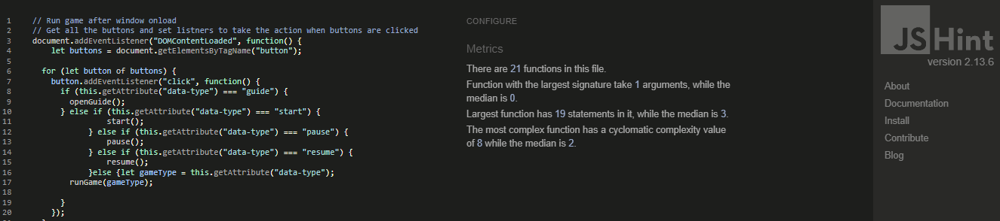   

### Unfixed Bugs ###

There is an unfixed bug.  
In order to shuffle the numbers randomly to start each puzzle game, I used a piece of code from Stack Overflow. It picks a number from the original array and excludes it from next draw. Repeating the loop until all the numbers are picked from the original array. Then a new array of numbers is randomised and no 2 numbers are repeated.  
It is a clever way to randomise numbers but some of the number orders generated from this method will make the puzzle unsolvable. A more comprehensive shuffle method required to fix this bug.  
With the limited time and available languages, the compromised way is to use the restart button for users to exit the current game anytime when they found the puzzle is impossible to solve.

## Deployment ##

### Version Control ###

The site was created at gitpod. It was then pushed to github to the remote repository ‘puzzlefun’ throughout the development.

The commonly used git commands to push code to the remote repository are as follows:

- git add <file>/ git add . - This command was used to add the modified file(s) to the staging area before they are committed.

- git commit -m “commit message” - This command was used to commit changes to the local repository queue ready for the final step.

- git push - This command was used to push all committed code to the remote repository on github.

### To deploy to Github pages ###

The site was deployed to GitHub pages. The steps to deploy are as follows:

- At the GitHub puzzlefun repository page, navigate to the Settings tab
- From the menu on left select 'Pages'
- From the source section drop-down menu, select the Branch: main
- Click 'Save'
- A live link will be displayed at top of the page in a banner when published successfully.
The live link can be found here - https://yuyizhong.github.io/puzzelfun/

### Clone the Repository Code from github desktop ###

Navigate to the GitHub Repository you want to clone to use locally:

- Click on the code drop down button
- Click on HTTPS
- Copy the repository link to the clipboard
- Open your IDE of choice (git must be installed for the next steps)
- Type git clone copied-git-url into the IDE terminal
- The project will now been cloned on your local machine for use.

## Credits ##

As always my mentor Daisy Mc Girr gives me very suggestive advices to make a quality website!

 ### Content ###
 - I borrowed a block of code to shuffle the puzzle numbers from [Satck Overflow](https://stackoverflow.com/questions/2450954/how-to-randomize-shuffle-a-javascript-array). The acture code is also commented at script.js. 
 - I built a sticky footer using the method from [CSS-Tricks](https://css-tricks.com/couple-takes-sticky-footer/).  
 - Favicon files were created at [Favicon Generator](https://favicon.io/favicon-converter/)
 - The icons were taken from [Font Awesome](https://fontawesome.com/)
 - I used [W3school](w3schools.com) to check the syntaxes and relevant attributes to get my website presented the way I wanted.
 

 ### Media ###

 - The photos I used for logo and game area background are from [Adobe free photo stock](https://stock.adobe.com/).
