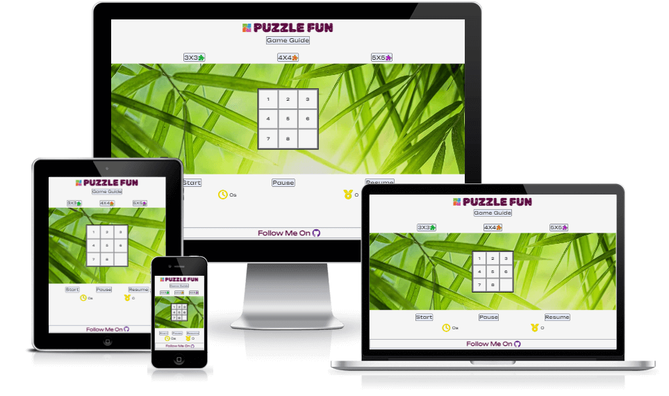

# Puzzle Fun

## Introduction
Puzzle Fun is a web based online game built in with HTML, CSS and JavaScript. It is based on simple classic sliding square puzzle game. Users would receive amazing cognitive benefits while having fun. Puzzle Fun is designed to target those who would like a short fun game to play regularly to improve their memeory, problem solving skills and reduce their stress level.  
  

| Site Goals| User Benefits | 
|:------------- | :------------ | 
|Short game with simple instruction | Simple and short Brain excercise | 
|Easy and intuitive navigation| Easy to start, exit and restart|
|Responsive design | Able to play on any device (keyboard or touchscreen)|  
|Selection of Deficulty levels|A choice of easy or challenge|
|Relax and also engaging |Confortable to play|
|interactive to the player|Have a control in running the game|
|Score tracking and timimg|Able to see the performance|

Press CTRL+ Click [here](https://yuyizhong.github.io/puzzelfun/) to visit the live website.

