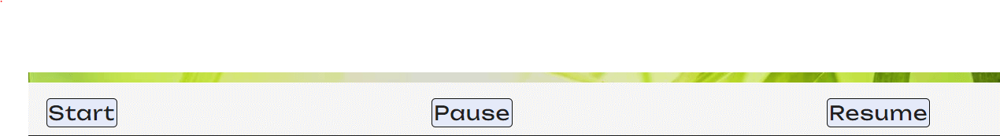

# Puzzle Fun

## Introduction
Puzzle Fun is a web based online game built in with HTML, CSS and JavaScript. It is based on simple classic sliding square puzzle game. Users would receive amazing cognitive benefits while having fun. Puzzle Fun is designed to target those who would like a short fun game to play regularly to improve their memeory, problem solving skills and reduce their stress level.  
  

| Site Goals| User Benefits | 
|:------------- | :------------ | 
|Short game with simple instruction | Simple and short Brain excercise | 
|Easy and intuitive navigation| Easy to start, exit and re-enter the game|
|Responsive design | Able to play on any device (keyboard or touchscreen)|  
|Selection of Deficulty levels|A choice of easy or challenge game|
|Relax game environment |Confortable to play|
|interactive to the player|Have a control in running the game|
|Score tracking and timimg|Able to see the performance|

Press CTRL+ Click [here](https://yuyizhong.github.io/puzzelfun/) to visit the live website.

## Features
This site was built based on a simple and intutive principle. It only contains one page with the puzzle game created and inserted each time by javascript according to users' instruction. The whole layout is simple and easy to navigate, and the purpose of the site is straight-forward. Icons and aria-lables are used through out the web page to enhance suers' comprehension.  

 

### Existing Features

- **Favicon**
   - A favicon is implemented with a colorful four-pieces puzzle.
   - This puzzle logo appears in the the tab header to allow the user to easily identify the website while multiple tabs opening.
     

- **Logo and Title**
   - The colorful puzzle logo and the gemstone-sparkled title bring the website alive.   
   - It carrys out the simple style and declares the the purpose of the website: puzzle games and fun!  
     

- **Game Guide Modal**
   - A modal button created underth the page title is named "Game Guide". It contains the game information , rull and level difference for users' reference.   
       
   - By clicking on it, a detailed game guide block drops out. When the user reading it on mobile, a scroll bar appears for them to scroll through the guide. When screen size is big enough, the scroll bar becomes hidden.
   - The benifit of having the game guide as a modal makes the website clean and neat. 
   - A zoom animation used when the guide block opens.    
     

- **Puzzle type selection panel**
   - Puzzles are divided into 3 types according to the difficulty level.   
   - They are listed at the selection panel for the user to choose. Users can either have a easy go by starting a 3x3 puzzle, or take a challenge for more complicated          level.     
     

- **Game area and default game**
   - A beaufiful picture of bamboo leaves is set as the background image for game area.  The eye friendly green color would hopfully reduce the user's eye strain. This photo image is soppused to imediately create a peaceful and leisurely enviroment.   
   - As the page loaded, a default 3x3 demo puzzle is appeared at the center of the game area. The user can either click on "Start" to play a 3x3 puzzle or click on one of      the game type buttons to play a more challenging puzzle.      
     

- **Demo puzzle**
   - Demo puzzle appears after the game type is selected. It demonstrates what a resolved puzzle in this particular puzzle type would look alike.   
   - Its tiles are not movable and tiles color are all in white. Therefore users wont mistake it as the game itself.  
   **4x4 Demo Puzzle**     
       
   
   **5x5 Demo Puzzle**  
   
   - When Demo puzzle displays in the game area, the control panel and user performance trackers remain as default setting.  
   

- **Control Panel**
   - Control buttons listed underneath the game area give flexibility to users to run the game.  
     
   - **Start** Button:  
      - **"Start"** button allows the the tiles in the demo puzzle to shuffle and a new game with the empty tile in **BLACK**will be ready to play.
      - After clicking on the "start" button, it changes to **“Restart"**. Users can click on **Restart** button any time to refresh a new puzzle within the same game type.
      - By click on both **Start** and **Restart** button, the clock icon will reset to 0 and start to time.
      - Which means users have the freedom to exit the current puzzle game before finishing it and start a new game.  
          
   - **Pause** Button
      - **Pause** Button allows the user to pause the timer anytime they needed.
      - Their performance wont be affected by interruptions.    
          
   - **Resume** Button
      - It continue the timer from where it stops.   
          

- **Game Time and Score trackers**
   - The intuitive clock and medal icons represent the timer and score.  
        
   - Timer tracks the total sesonds which user spend in each single game. It resets to zero everytime a new game is displayed regardless puzzle type. 
   - Score increments within one level(either 3x3,4x4 or 5x5 puzzles). It resets to zero when user hits one of the puzzle type button.
   - Witht the time and score tracking system, users are able to see their performance. Which makes the game more engaging.
       
       

- **Footer**
   - A footer is fixed to the bottom of the viewport and it is always there while users scroll up and down the page. 
   - It contains site owner's GITHUB link which will open in a new tab to allow easy navigation for users.   
      

- **Winning messsage**
   - Wining message appears when the user solve the puzzle.  
   - It alerts a congratulation message including the time spent for solving this puzzle.   
      

   

